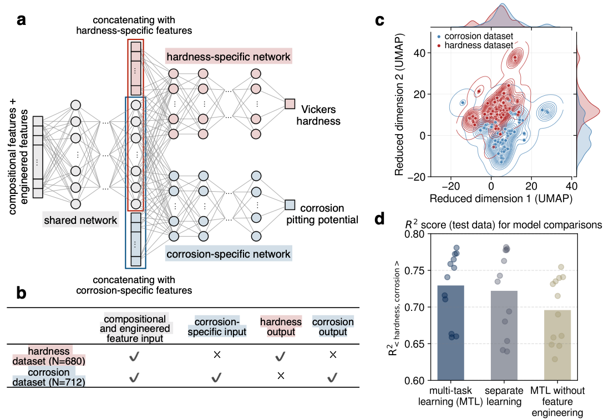
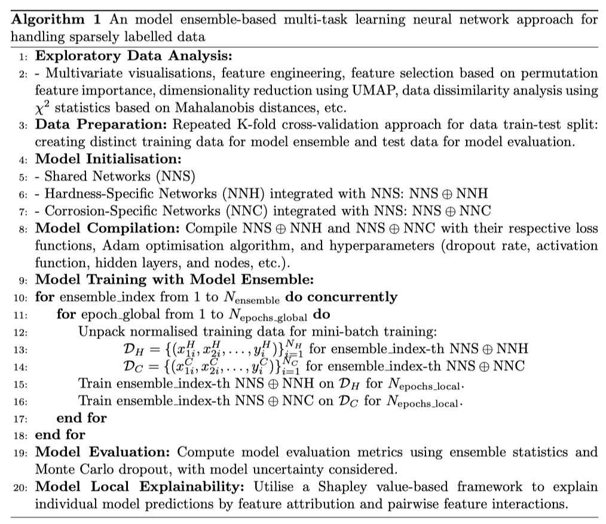

# Multi-Task Learning Neural Network for Sparsely Labelled Data

## Overview

This project utilises a hard parameter sharing approach for multi-task learning in neural networks to model multiple material properties. The architecture employs shared hidden layers for multiple tasks before branching into task-specific networks.

The primary problem addressed is the training of sparsely labelled data, such as non-concurrent hardness and corrosion measurements in disparate datasets in materials science. It's implemented together with model ensembling.

This repository contains the complete workflow: exploratory data analysis, data preparation, model compilation, training, evaluation, and explainability steps.

## Methodology

The training algorithm operates iteratively, alternating between data types (hardness/corrosion) to update the weights in both shared and task-specific networks. This method allows separate yet intrinsically linked models for hardness and corrosion to share weights in the hidden layers.

 
#### Key Features

- **Shared and Task-Specific Networks:** Leverages shared representations to improve learning efficiency and reduce overfitting.
- **Model Ensemble and Uncertainty Quantification:** Employs ensemble learning for handling heterogeneous small datasets. Together with Monte Carlo dropout, it quantifies the model's uncertainty by multiple inferences per input.
- **Hyperparameter Optimization:** Utilises Bayesian Optimisation for efficient hyperparameter search (especially subnetwork configurations), optimising model performance based on \(R^{2}\) score.
- **Model Explainability:** Implements a Shapley value-based framework for local explainability of model predictions.
- All the above features are unified in one model.

## Implementation 

The project is implemented using [TensorFlow](https://github.com/tensorflow/tensorflow)/[Keras](https://github.com/keras-team/keras.git), with Bayesian hyperparameter tuning by [GPyOpt](https://github.com/SheffieldML/GPyOpt), and feature attribution by a [gradient-based explainer](https://github.com/suinleelab/path_explain) etc.
 
The original datasets used in this project: mechanical properties ([Borg et al.](https://doi.org/10.1038/s41597-020-00768-9)) and corrosion properties ([Nyby et al.](https://doi.org/10.1038/s41597-021-00840-y)).
