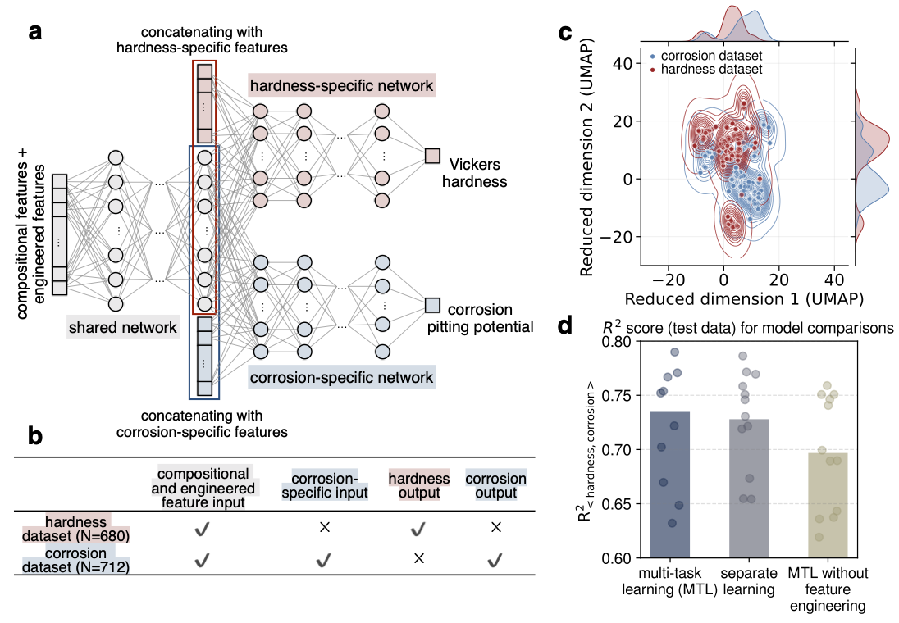
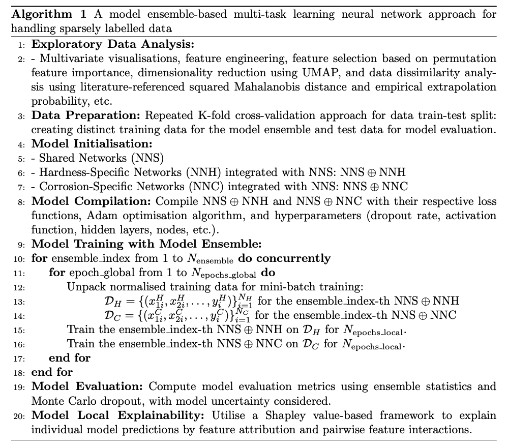

# Multi-Task Learning Neural Network for Sparsely Labelled Data

This submodule contains the machine learning part of the [exploratory workflow](https://github.com/YXWU2014/CCA_CALPHAD_SSS_ML): cleaned datasets, exploratory notebooks, training notebooks, saved-model outputs, and utility code for evaluation, prediction, and explainability.

This ML submodule utilises a hard parameter sharing approach for multi-task learning in neural networks to model multiple material properties, with shared hidden layers followed by task-specific branches. The main challenge addressed here is sparsely labelled data, such as non-concurrent hardness and corrosion measurements in disparate materials datasets.

For understanding the workflow, the primary notebook to read first is `03_Model_Train_Evaluate_Predict/NN_full_v3_BO_Train_Eval_Pred_master_optimal.ipynb`. The Papermill batch scripts in `05_Model_BO_batch/` are mainly an automation layer for hyperparameter optimization and repeated notebook execution rather than the best first entrypoint for a new reader.



The training algorithm operates iteratively, alternating between hardness and corrosion batches to update both the shared layers and the task-specific branches. This allows separate yet intrinsically linked models for hardness and corrosion to learn from shared latent structure.

#### Key Features

- **Shared and Task-Specific Networks:** Leverages shared representations to improve learning efficiency and reduce overfitting.
- **Model Ensemble and Uncertainty Quantification:** Employs ensemble learning for handling heterogeneous small datasets. Together with Monte Carlo dropout, it quantifies model uncertainty by the variance of multiple inferences per input.
- **Hyperparameter Optimization:** Utilises Bayesian Optimisation for efficient hyperparameter search, especially for subnetwork configurations, optimizing model performance using the `R^2` score.
- **Model Explainability:** Implements a Shapley value-based framework for local explainability of model predictions.
- **Integrated Workflow:** Combines the shared/task-specific architecture, ensemble uncertainty, Bayesian optimisation, and explainability in one workflow.



## Implementation

The project is implemented using [TensorFlow](https://github.com/tensorflow/tensorflow) and [Keras](https://github.com/keras-team/keras.git), with dimensionality reduction by [UMAP](https://github.com/lmcinnes/umap.git), Bayesian hyperparameter tuning by [GPyOpt](https://github.com/SheffieldML/GPyOpt), and feature attribution by a [gradient-based explainer](https://github.com/suinleelab/path_explain).

The original datasets used in this project are mechanical properties from [Borg et al.](https://doi.org/10.1038/s41597-020-00768-9) and corrosion properties from [Nyby et al.](https://doi.org/10.1038/s41597-021-00840-y).

## Workflow Scope

The workflow covers:

- cleaned experimental and computed datasets
- engineered-feature generation
- EDA and dimensionality reduction
- repeated-k-fold model training
- Bayesian optimization for hyperparameter optimisation
- prediction on new CALPHAD-derived compositions
- explainability outputs

## Prerequisites

Install the root repository Python environment first:

```bash
cd ..
python -m venv .venv
source .venv/bin/activate
python -m pip install --upgrade pip setuptools wheel
pip install -r requirements.txt
pip install papermill
```

The current codebase assumes TensorFlow/Keras versions compatible with the pins in the root `requirements.txt`.

## Folder Guide

- `01_Dataset_Cleaned/`: cleaned Excel datasets and processed ML inputs
- `02_Dataset_EDA_Feature_UMAP_Mahalanobis/`: EDA notebooks and exported figures
- `03_Model_Train_Evaluate_Predict/`: primary train/evaluate/predict notebooks
- `04_Model_Saved/`: generated model folders, weights, workbooks, and figures
- `05_Model_BO_batch/`: batch launchers for repeated notebook execution and hyperparameter optimization
- `utils/`: shared preprocessing, model, explainability, and postprocessing utilities

## Filesystem Layout and Data Flow

This submodule is organized into three main parts:

- `01_Dataset_Cleaned/` and `02_Dataset_EDA_Feature_UMAP_Mahalanobis/` are the main source-data and analysis areas
- `03_Model_Train_Evaluate_Predict/` and `05_Model_BO_batch/` are the execution layer
- `04_Model_Saved/` is the generated-output area and will grow as notebooks and batch runs are executed

A practical way to read the directory tree is:

```text
CCA_representation_ML/
├── 01_Dataset_Cleaned/                  # curated ML inputs
├── 02_Dataset_EDA_Feature_UMAP_Mahalanobis/  # exploratory notebooks and exported plots
├── 03_Model_Train_Evaluate_Predict/     # main notebooks to run manually
├── 04_Model_Saved/                      # generated model folders and prediction outputs
├── 05_Model_BO_batch/                   # automation scripts that execute notebook variants
└── utils/                               # shared Python modules imported by notebooks/scripts
```

Outside this submodule, the workflow depends on the repository root Python environment plus any external CALPHAD-derived input folders referenced by the prediction notebooks. In practice, the workflow reads from `01_Dataset_Cleaned/`, executes notebooks from `03_Model_Train_Evaluate_Predict/` or scripts from `05_Model_BO_batch/`, and writes results into `04_Model_Saved/`.

## Inputs

### 1. Cleaned ML datasets

Located in `01_Dataset_Cleaned/`, including:

- literature datasets
- processed hardness/corrosion workbooks
- saved scalers and feature resources

### 2. CALPHAD / SSS computed data

For new-composition prediction generated via [permutational combinatorial mixing](https://github.com/YXWU2014/combinatorial_mixing/), the workflow references:

`../../v6_A-B-C-D-E_Sputtering_ML/v6_A-B-C-D-E_Sputtering_ML_All_Calc/`


## Recommended Reading and Run Order

### Read the primary workflow notebook

- `03_Model_Train_Evaluate_Predict/NN_full_v3_BO_Train_Eval_Pred_master_optimal.ipynb`

Use this notebook to understand the main optimized train/evaluate/predict workflow. `03_Model_Train_Evaluate_Predict/NN_full_v3_BO_Train_Eval_Pred_master_optimal_retrain.ipynb` is the follow-on notebook for retraining and downstream prediction.

### Use the batch launcher only for automated hyperparameter optimization

```bash
cd CCA_representation_ML/05_Model_BO_batch
python NN_full_v3_BO_batch_ws15.py
```

This script:

- sets `MASTER_PATH = ../03_Model_Train_Evaluate_Predict/`
- sets `MODEL_PATH = ../04_Model_Saved/`
- executes the notebook family `NN_full_v3_BO_Train_Eval_Pred_master`
- creates output model folders named like `NN_full_v3_BO_<id>`
- runs the notebook IDs listed in `file_nums` inside the script

### Another Notebook Variant

`NN_full_v3_BO_Train_Eval_Pred_master_microstructure.ipynb` is a separate workflow branch that introduces explicit microstructure input columns such as `microstructure_BCC`, `microstructure_FCC`, and `microstructure_other`, together with a microstructure-aware preprocessing pathway. This branch was not used further because those added features led to degraded training performance.


## Outputs

Outputs are written under `04_Model_Saved/`, including:

- model folders generated by notebook runs and batch optimization runs
- saved `.h5` models for repeated k-fold runs
- optimization summaries such as `hypertable_sort_*.xlsx`
- prediction workbooks for new compositions
- uncertainty plots
- explainability and SHAP-style figures

If execution succeeds, you should see new or updated folders under `04_Model_Saved/` and an executed notebook copy in the matching model folder.

## Other Analysis Stages

### EDA and feature analysis

Use notebooks in `02_Dataset_EDA_Feature_UMAP_Mahalanobis/` for:

- pair plots
- PCA / UMAP visualization
- local Mahalanobis distance inspection
- feature-calculation analysis

These notebooks are analysis stages, not the main workflow entrypoint.

### Utility modules

The `utils/` package contains the reusable logic used by the notebooks, including:

- `preprocessing_kfold_norm.py`
- `multitask_nn.py`
- `BO_hyper_objective.py`
- `postprocessing_prediction.py`
- `postprocessing_evalutation.py`
- `postprocessing_explainer.py`


## Full Rerun Recipes

### Train/evaluate using existing cleaned data

1. Activate the root Python environment.
2. Confirm `01_Dataset_Cleaned/` is populated.
3. Run the primary workflow notebook `03_Model_Train_Evaluate_Predict/NN_full_v3_BO_Train_Eval_Pred_master_optimal.ipynb`.
4. Use `05_Model_BO_batch/NN_full_v3_BO_batch_ws15.py` only if you want automated hyperparameter optimization or repeated execution.
5. Inspect `04_Model_Saved/` for the executed notebook, saved weights, and plots.

### Predict on new CALPHAD-derived compositions

1. Confirm the root-level folder `v6_A-B-C-D-E_Sputtering_ML/v6_A-B-C-D-E_Sputtering_ML_All_Calc/` exists.
2. Run the relevant prediction notebook, typically `NN_full_v3_BO_Train_Eval_Pred_master_optimal_retrain.ipynb`.
